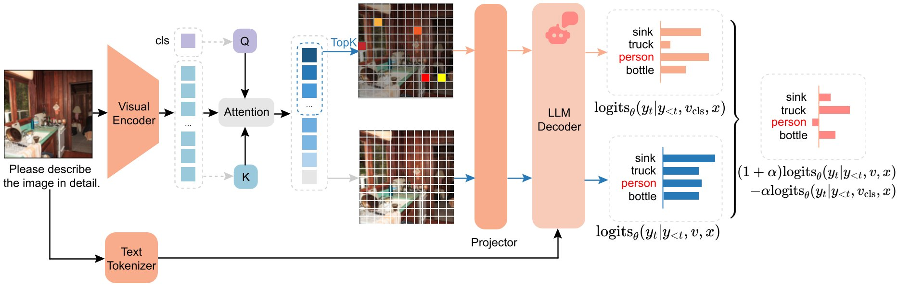
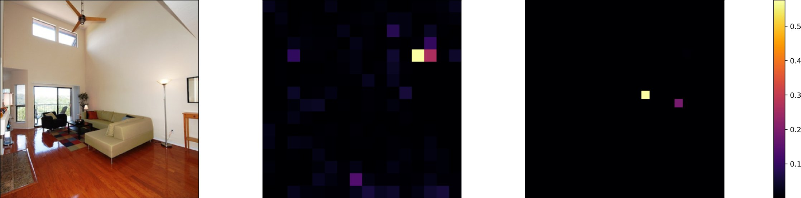
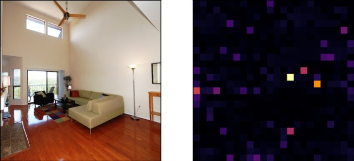
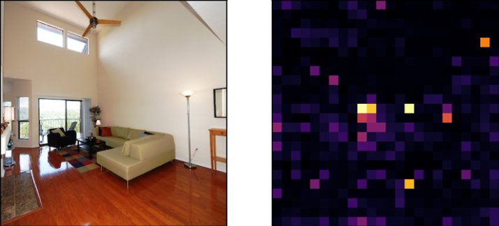
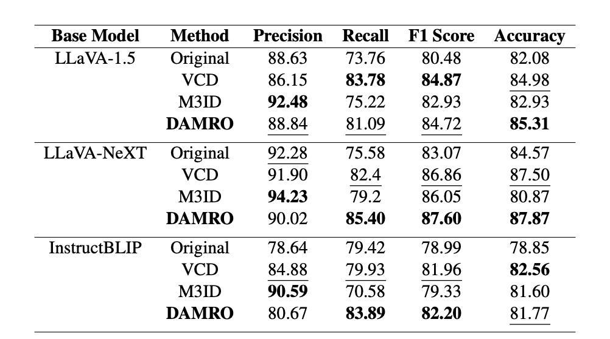
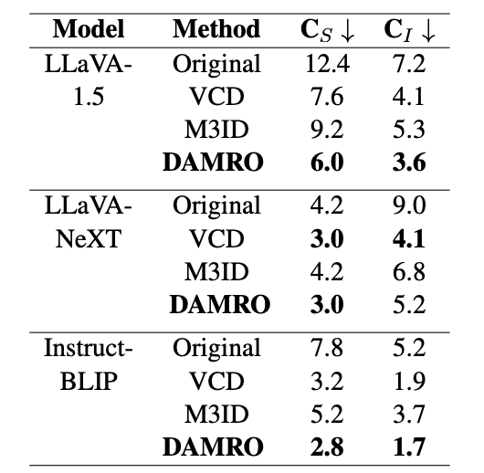
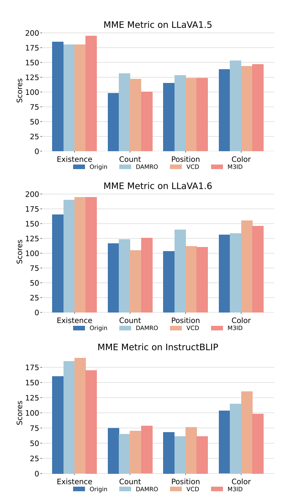
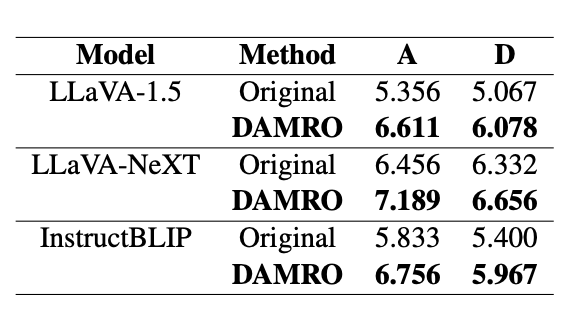
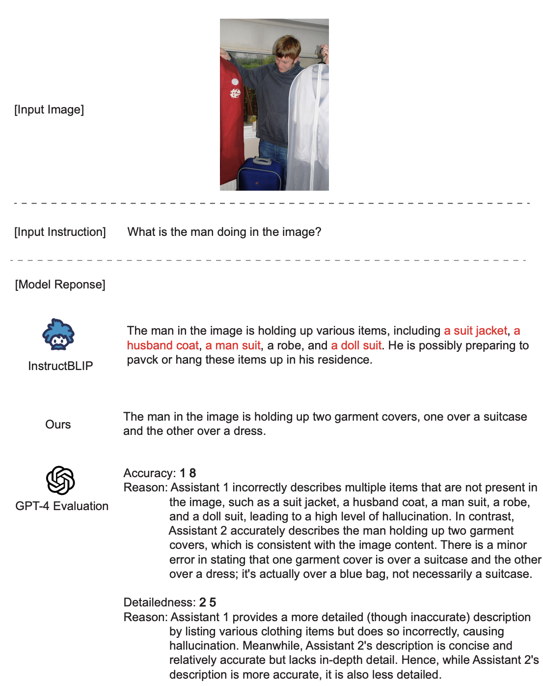
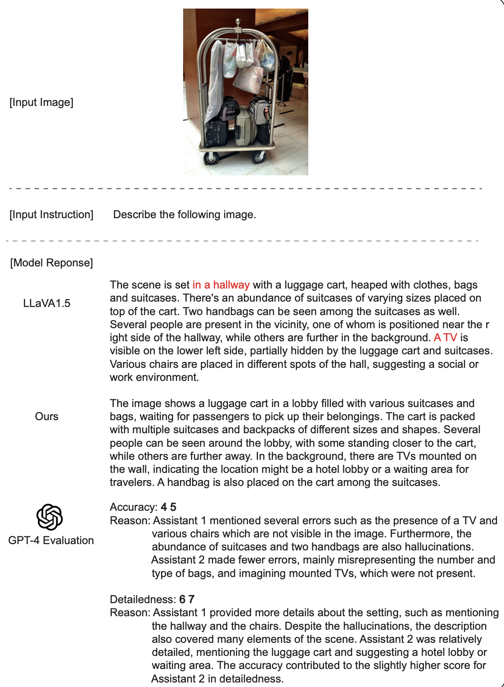

<div align="center">

# **DAMRO: Dive into the Attention Mechanism of LVLM to Reduce Object Hallucination**

</div>

<div align="center">

[](https://arxiv.org/abs/2410.04514)
[](https://github.com/coder-gx/DAMRO)
[](https://underline.io/lecture/108993-damro-dive-into-the-attention-mechanism-of-lvlm-to-reduce-object-hallucination)


</div>

The official repository for the  paper "DAMRO: Dive into the Attention Mechanism of LVLM to Reduce Object
Hallucination"

<p align="center">
  
   <br>
  <em>Figure 1: An overview of DAMRO.</em>
</p>

## 🔥 News

- [x] All code has been uploaded  to GitHub.
- [x] This is our [Arxiv Paper]([./paper_pdf/ACL_ARR_OCT_preprint.pdf](https://arxiv.org/abs/2410.04514)) Link.
- [x] Our paper is accepted by **EMNLP 2024 Main**.

  
## 🌟 Key Highlights
1. We conduct in-depth analysis of the relationship between the attention maps of the visual
encoder and the LLM decoder, revealing a
high consistency in the distribution of their
outlier tokens.
2. We analyze the impact of the consistency on
object hallucination and design the DAMRO
method to mitigate the hallucination in
LVLMs.
3. We demonstrate effectiveness of our method
via extensive experiments on various models
and benchmarks. Moreover, our training-free
approach is applicable to most LVLMs without external knowledge or models.

## 🚀 Quick Start
### Prepare Code and Data
```bash
git clone https://github.com/coder-gx/DAMRO.git
````

Clone the GitHub repository to your local directory.
Download [coco val2014](http://images.cocodataset.org/zips/val2014.zip) and [MME](https://huggingface.co/datasets/lmms-lab/MME), then place them along with the remaining datasets into the [data](./data) folder.
The final `data` directory structure should look like this:

```bash
DAMRO/
├── data/
│   ├── chair/
│   ├── coco/
│   │   ├── annotations/
│   │   └── val2014/
│   ├── gpt4v/
│   ├── mme/
│   └── pope/
│       └── coco/
```

### Environment Setup

```bash
conda create -n damro python==3.9
conda activate damro
cd DAMRO
pip install requirement.txt
pip install -e ./transformers-4.43.0
```

Here we use a modified version of **transformers** adapted for DAMRO.
Compared to the original code, the modifications mainly involve three areas:

1. **Model-related files**, including
   [modeling_llava.py](./transformers-4.43.0/src/transformers/models/llava/modeling_llava.py),
   [modeling_llava_next.py](./transformers-4.43.0/src/transformers/models/llava_next/modeling_llava_next.py), and
   [modeling_instructblip.py](./transformers-4.43.0/src/transformers/models/llava/modeling_instructblip.py).

2. **In `generation.py`**,
   [add parameters](https://github.com/coder-gx/DAMRO/tree/main/transformers-4.43.0/src/transformers/generation/utils.py#L1588-L1592) and
   [transfer parameters](https://github.com/coder-gx/DAMRO/tree/main/transformers-4.43.0/src/transformers/generation/utils.py#L2003-L2007).

3. **Replace the `_sample.py` function implementation** in
   [sample.py](./sample_method/sample.py).

### Start Inference

Our code supports **LLaVA-1.5**, **LLaVA-NeXT**, and **InstructBLIP** models.
We reproduce the four benchmarks used in the paper, with usage examples shown below:

#### 1. POPE

```bash
# generation
python ./evaluation/eval_pope/run_pope.py \
   --model_path <your_model_path> \
   --image_folder ./data/coco/val2014 \
   --question_file ./data/pope/coco/coco_pope_random.jsonl \
   --answers_file ./output/damro_eval_pope_instructblip_random_alpha0.5_beta0.1_topk4.jsonl \
   --damro_alpha 0.5 \
   --damro_topk 4 \
   --damro_beta 0.1 \
   --use_damro \
   --seed 42 \
   --batch_size 1

# evaluation
python ./evaluation/eval_pope/eval_pope.py \
   --gt_files ./data/pope/coco/coco_pope_random.jsonl \
   --gen_files ./output/damro_eval_pope_instructblip_random_alpha0.5_beta0.1_topk4.jsonl
```

#### 2. CHAIR

```bash
# generation
python ./evaluation/eval_pope/run_chair.py \
   --model_path <your_model_path> \
   --image_folder ./data/coco/val2014 \
   --question_file ./data/pope/coco/coco_pope_random.jsonl \
   --answers_file ./output/damro_eval_chair_instructblip_alpha0.5_beta0.1_topk4.jsonl \
   --damro_alpha 1.5 \
   --damro_topk 4 \
   --damro_beta 0.1 \
   --use_damro \
   --seed 42 \
   --batch_size 1

# evaluation
python ./evaluation/eval_chair/eval_chair.py \
   --cap_file ./output/damro_eval_chair_instructblip_alpha1.5_beta0.1_topk4_direct2.jsonl \
   --image_id_key "image_id" \
   --caption_key "caption" \
   --cache ./evaluation/eval_chair/chair.pkl \
   --coco_path ./data/coco/annotations \
   --save_path ./output/chair_detail/damro_eval_chair_instructblip_alpha1.5_beta0.1_topk4_detail.json
```

#### 3. MME Subset

```bash
# generation
python ./evaluation/eval_mme/run_mme.py \
   --model_path <your_model_path>  \
   --question_file ./data/mme \
   --answers_file ./output/damro_eval_mme_llava-next_alpha2_beta0.1_topk10.jsonl \
   --damro_alpha 2 \
   --damro_topk 10 \
   --damro_beta 0.1 \
   --use_damro \
   --seed 42 \
   --batch_size 1

# evaluation
python ./evaluation/eval_mme/eval_mme.py \
--gen_file ./output/damro_eval_mme_llava-next_alpha2_beta0.1_topk10.jsonl
```

#### 4. GPT4V-Aided Evaluation

```bash
# generation
python ./evaluation/gpt4v_aided/run_gpt4v_aided.py \
   --model_path <your_model_path>  \
   --image_folder ./data/coco/val2014 \
   --question_file ./data/gpt4v/gpt4v.jsonl \
   --answers_file ./output/damro_eval_gpt4v_llava-1.5_alpha2_beta0.1_topk10.jsonl \
   --damro_alpha 2 \
   --damro_topk 10 \
   --damro_beta 0.1 \
   --use_damro \
   --seed 42 \
   --batch_size 1

# evaluation
python ./evaluation/gpt4v_aided/eval_gpt4v.py \
    --file_path1 ./output/original_eval_gpt4v_llava-1.5.jsonl \
    --file_path2 ./output/damro_eval_gpt4v_llava-1.5_alpha2_beta0.1_topk10.jsonl \
    --save_path ./output/gpt4v_detail/damro_eval_gpt4v_llava-1.5_alpha2_beta0.1_topk10_detail.json \
    --image_folder ./data/coco/val2014
```

More usage examples can be found in the [scripts](./mnt-nfsdata/gongxuan/data-1/gx_damro/scrpits) folder,
where `run_generation.sh` is used for generation and `eval_generation.sh` for final score computation.


## 📊 Experiments

### 1. Drawbacks of ViT
- The attention map of LVLMs’ visual encoder
also focus on a small number of high-norm outlier
tokens.
 
<p align="center">
  
   <br>
  <em>Figure 2: Attention map of visual encoder. Left: original image. Middle: attention map of InstructBLIP ViT
(16x16). Right: attention map of LLaVA-1.5 ViT (24x24).</em>
</p>

### 2. Outlier Tokens Cause Hallucination
- It can be observed
that outlier tokens in visual encoding stage indeed
have influence on the subsequent LLM decoding
stage, which is closely related to the occurrence of
hallucinations.

<p align="center">
  
  <br>
  <em>Figure 3: LLM decoder attention map of "plant" token (non-hallucinatory). It is evident that attention can
accurately locate the position of the plotted plant.</em>
</p>

<p align="center">
  
  <br>
  <em>Figure 4: LLM decoder attention map of "clock" token (hallucinatory). The attention mainly focus on the
outlier tokens in the background, whose positions are
the same in visual encoder attention map in the right
sub-image of Figure 2.</em>
</p>


### 3. DAMRO Results
- We evaluate our method on LVLMs including LLaVA-1.5, LLaVA-NeXT and InstructBLIP, using various benchmarks such as POPE,
CHAIR, MME and GPT-4V Aided Evaluation.
The results demonstrate that our approach significantly reduces the impact of these outlier
tokens, thus effectively alleviating the hallucination of LVLMs. 

<p align="center">
  
   <br>
   <em> Figure 5: POPE.</em>
</p>

<p align="center">
  
   <br>
   <em> Figure 6: CHAIR.</em>
</p>

<p align="center">
  
   <br>
   <em> Figure 7: MME.</em>
</p>

<p align="center">
  
   <br>
   <em> Figure 8: GPT4V.</em>
</p>

## 📌 Examples
<p align="center">
  
  <br>
  <em>Figure 7: DAMRO’s performance on reducing hallucinations on on InstructBLIP.</em>
</p>

<p align="center">
  
  <br>
  <em>Figure 8: DAMRO’s performance on reducing hallucinations on LLaVA-1.5-7b.</em>
</p>


## 🥰 Acknowledgements

We thank the [VCD](https://github.com/DAMO-NLP-SG/VCD) team for providing the foundational codebase that we adapted to implement DAMRO. We also acknowledge the open-source community for providing the datasets and evaluation benchmarks that made this research possible.

## 📝 Citation

```bibtex
@misc{gong2024damrodiveattentionmechanism,
      title={DAMRO: Dive into the Attention Mechanism of LVLM to Reduce Object Hallucination}, 
      author={Xuan Gong and Tianshi Ming and Xinpeng Wang and Zhihua Wei},
      year={2024},
      eprint={2410.04514},
      archivePrefix={arXiv},
      primaryClass={cs.CL},
      url={https://arxiv.org/abs/2410.04514}, 
}
```

## 📄 License

This project is licensed under the MIT License - see the [LICENSE](LICENSE) file for details.
